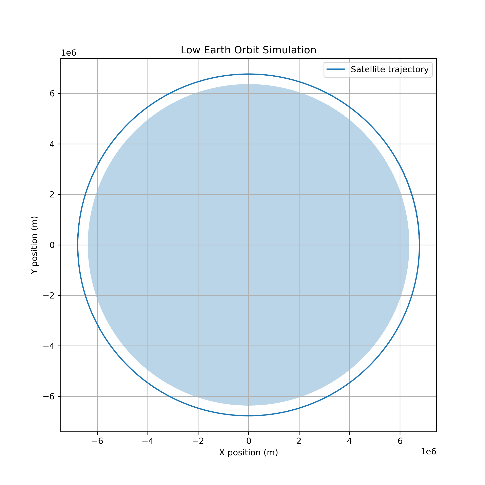

# 🚀 Orbital Mechanics Simulator

A Python-based orbital simulation project developed to explore spacecraft motion, satellite trajectories, and astrodynamics concepts.

---

## 🌍 Overview

This project simulates spacecraft motion around Earth using Newtonian gravitational mechanics.

The goal is to build a computational framework for understanding:

- Satellite orbits
- Orbital velocity
- Gravity interactions
- Space mission dynamics

---

## ✨ Features

Current capabilities:

- Two-body gravitational simulation
- Low Earth Orbit (LEO) trajectory modeling
- Satellite position propagation
- Orbital trajectory visualization
- Circular orbit velocity calculation

---

## 🧮 Mathematical Model

The spacecraft motion is modeled using Newton's law of universal gravitation.

The gravitational acceleration is calculated as:

\[
a = -\frac{GM}{r^3}r
\]

where:

- **G** = gravitational constant
- **M** = Earth mass
- **r** = spacecraft position vector

---

## 🛠️ Technologies

- Python
- NumPy
- Matplotlib
- SciPy

---

## 📂 Project Structure
Orbital-Mechanics-Simulator

├── src
│ ├── physics.py
│ └── orbit.py
│
├── examples
│ └── earth_orbit.py
│
└── results
└── orbit.png

---

## 🚀 Future Roadmap

- [ ] Runge-Kutta 4 (RK4) integration
- [ ] Keplerian orbital elements
- [ ] Hohmann transfer calculations
- [ ] Delta-v analysis
- [ ] Atmospheric drag modeling
- [ ] Multi-body simulations

---

## 👩‍🚀 Author

**Defne Canoğlu**

Aerospace Engineering & Artificial Intelligence enthusiast.

Research interests:

- Space systems
- Orbital mechanics
- Artificial intelligence
- Earth observation